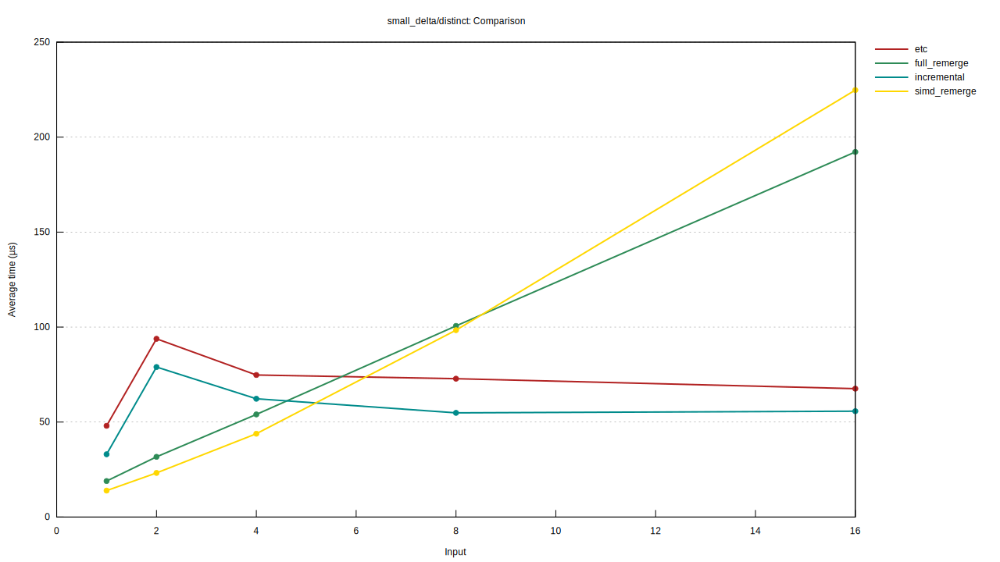
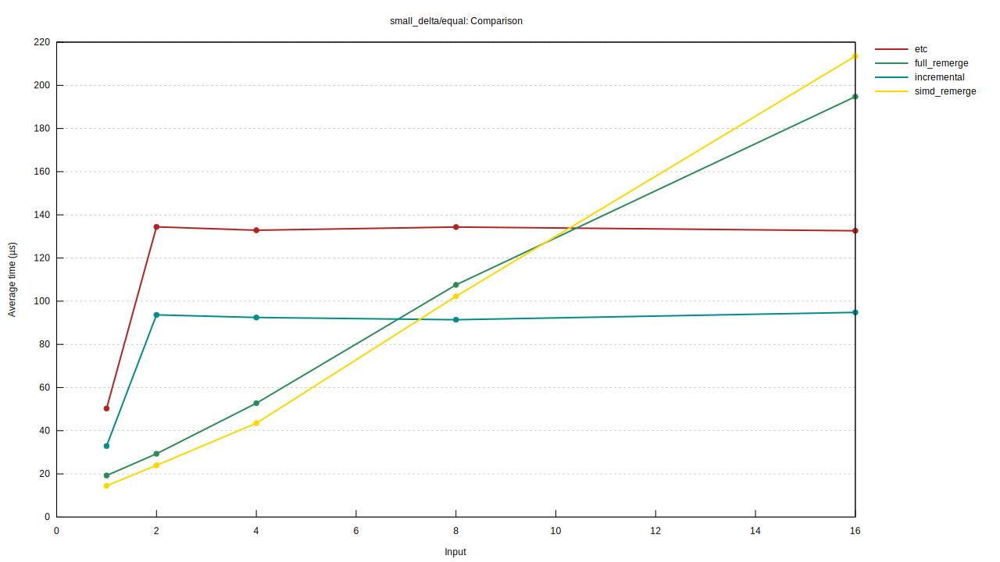
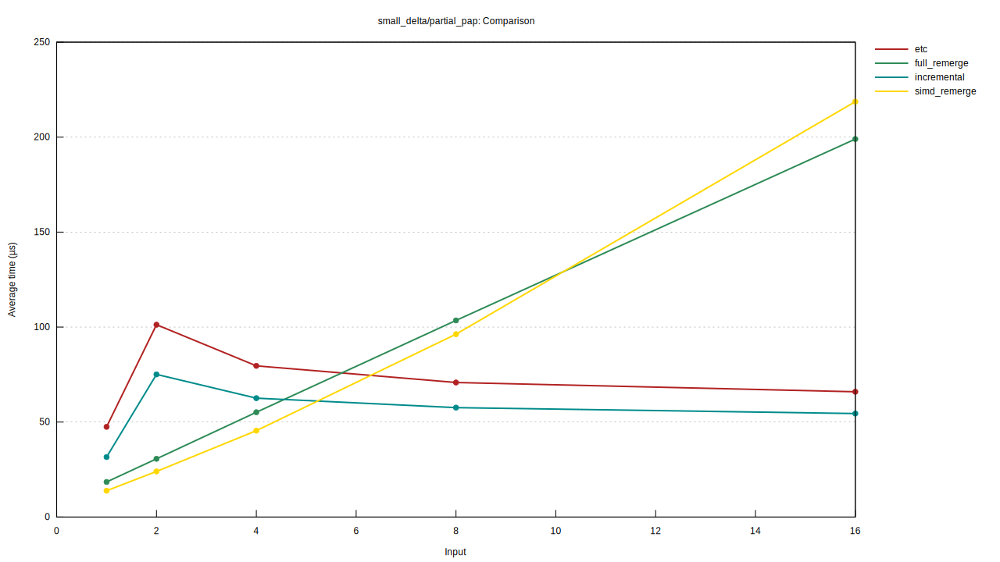
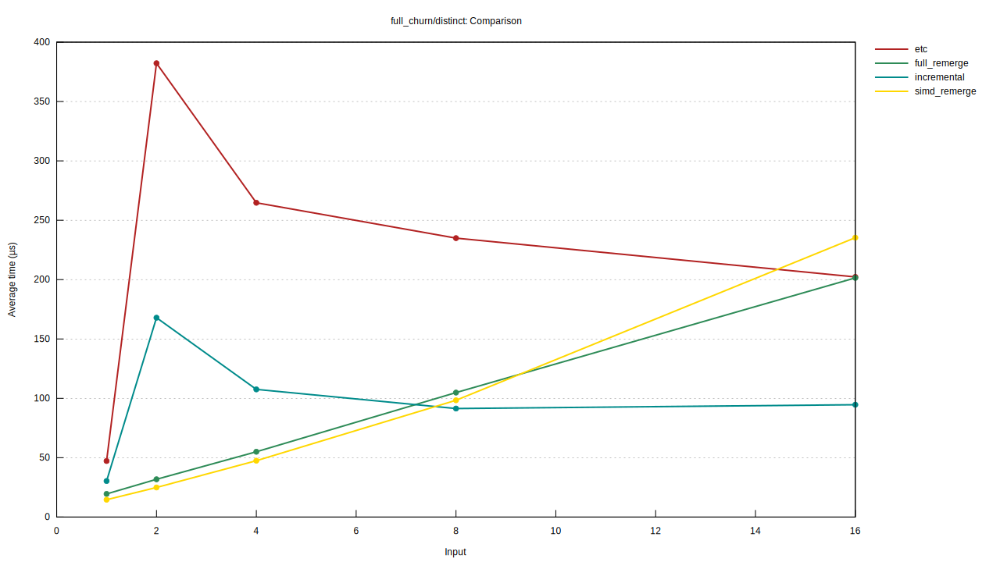
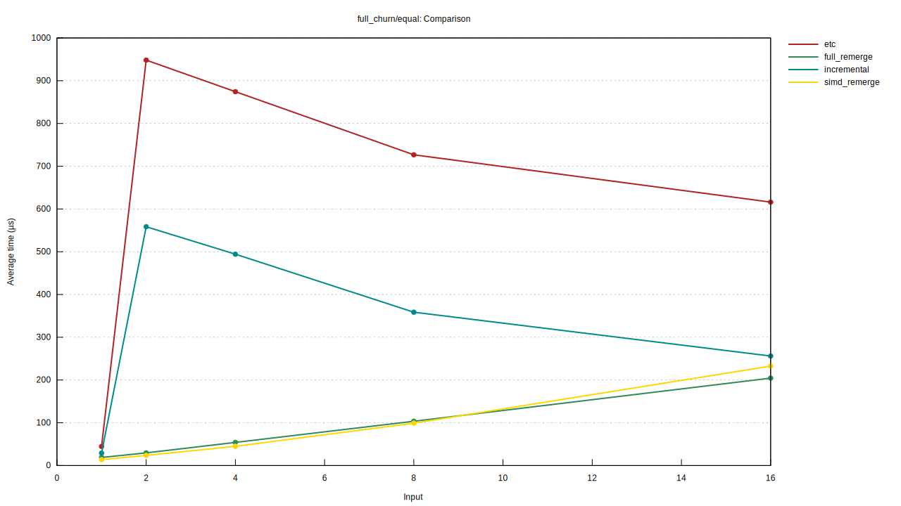
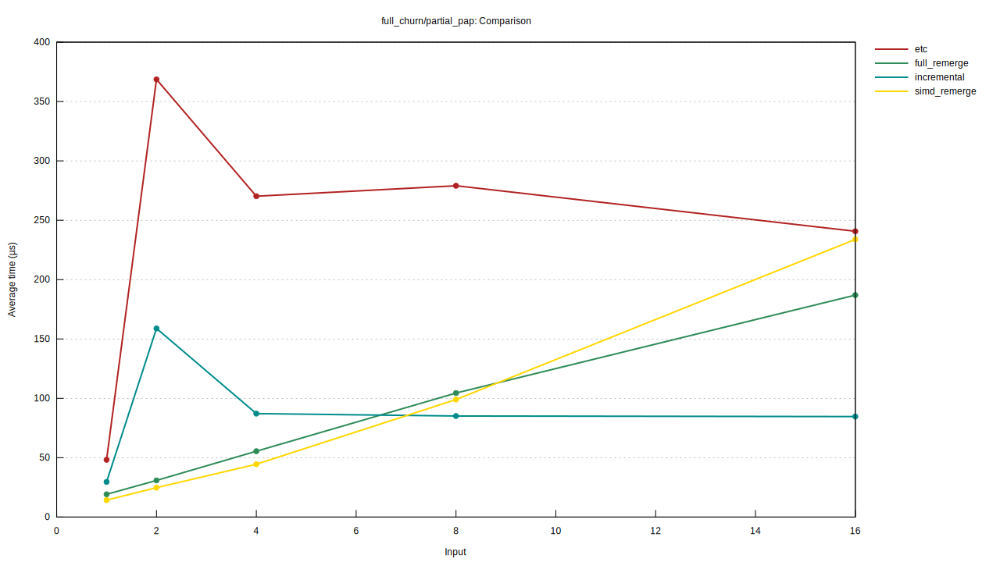
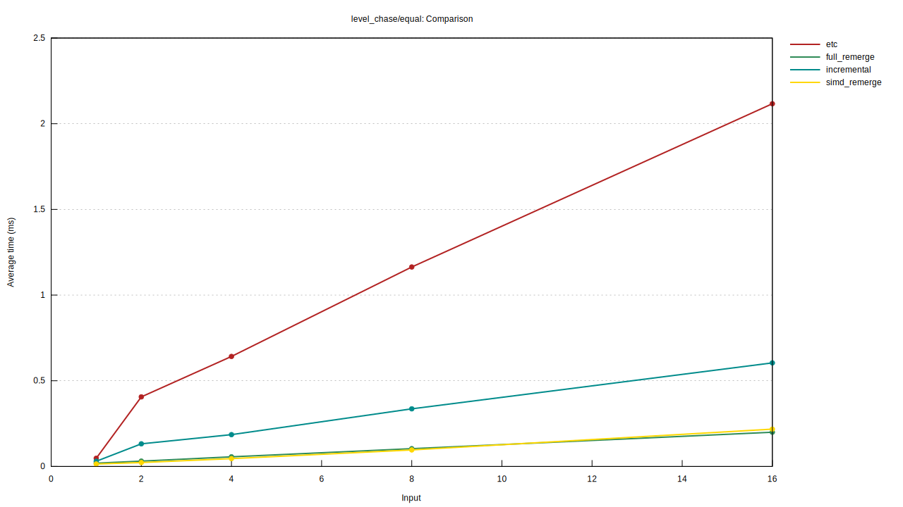
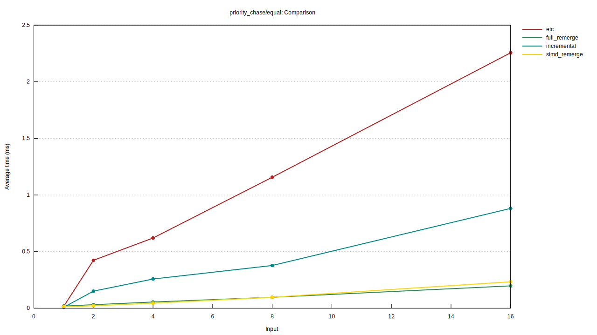

# merge-lab

A benchmark and correctness lab for the sACN DMX merger (the per-address-priority HTP merge). It was built to answer one design question before the merger was written into the `sacn` crate proper: _which implementation strategy is fastest, and by how much?_ The answer (and the evidence behind it) is in [What we found](#what-we-found) below; the chosen strategy, `FullRemerge`, is what ships in `sacn`.

This crate is preserved as the reproducible record of that decision, so the face-off can be re-run on new hardware or re-examined by anyone wanting to understand or challenge the choice. The production `sacn` merger is also included in benchmark comparisons run from this crate (note that at time of writing it is equivalent to `FullRemerge`)

## The merge

A merger combines several _sources_, each offering up to 512 DMX levels plus a per-slot priority, into one output. For each slot the winner is the source with the highest priority; ties are broken by the highest level (Highest-Takes-Precedence). The output records, per slot, the winning level, the winning priority, and the _owner_ (which source won). Priority comes either from explicit per-address priorities (PAP) or from a single universe priority converted per slot.

## The candidates

All implement the `Merger` trait, so one harness and one oracle drive them identically.

- **`Incremental`** is a faithful port of ETC's `dmx_merger.c` algorithm (single-source fast paths, the multi-source HTP adjust, the owner-decrease rescan), but over a flat `Vec` of sources instead of ETC's red-black tree. It touches only the slots that can have changed.
- **`FullRemerge`** recomputes every slot from scratch on each update, written branch-free so the compiler can autovectorize it.
- **`EtcMerger`** (only with `--features etc`) wraps the _real_ ETC sACN C library through FFI, so we can compare against the authoritative implementation directly.
- `SimdRemerge` (with implementations for aarch64/NEON, x86_64/AVX2 and x86_64/SSE2) is the same as `FullRemerge` but with hand-written SIMD optimizations.

## The reference ETC library

"ETC's implementation" here refers to [ETCLabs/sACN](https://github.com/ETCLabs/sACN). When including the reference ETC library using `--features etc` (recommended), you need `cmake`, a C toolchain, and (on the first build) network access: the build script clones a pinned ETC sACN release and builds it with its own CMake. It is built in the default Release configuration which enables dynamic memory. Env var overrides:

- `SACN_C_DIR=/path/to/sACN` uses an existing local checkout instead of cloning.
- `SACN_GIT_URL` / `SACN_GIT_REF` clone a different repo or tag.

## Running the correctness oracle

Always run this before trusting any timing: it confirms the candidates compute the same, correct merge.

```sh
cargo test -p merge-lab
cargo test -p merge-lab --features etc,simd   # Enables SIMD and the ETC library for comparison
```

The oracle has anchored unit tests (hand-computed HTP/PAP results), a differential property test (random operation sequences, checked after every step), and the generated workloads run through every candidate.

## Running the benchmarks

Rust candidates only (no external dependencies):

```sh
cargo bench -p merge-lab
```

Including the reference ETC C library and the SIMD candidates (recommended):

```sh
cargo bench -p merge-lab --features etc,simd
```

To run a subset, pass a filter (criterion matches benchmark ids against it):

```sh
cargo bench -p merge-lab --features etc -- small_delta              # one pattern
cargo bench -p merge-lab --features etc -- 'small_delta/equal'      # one group
cargo bench -p merge-lab --features etc -- 'small_delta/equal/incremental/8'  # one cell
```

## Reading the output

Each benchmark prints something like:

```
small_delta/equal/incremental/16
                        time:   [85.607 µs 86.527 µs 87.939 µs]
```

- The middle value of the `[low median high]` triple is the estimate; the outer two are the 95% confidence interval.
- `time` is **per timed iteration**, and one iteration replays all 256 frames of the workload, so per-update cost is `time / 256` (here ~338 ns/update). There is no updates/sec (`thrpt`) line: the benchmarks deliberately leave `Throughput` unset so the source count drives the comparison line chart (see below); the rate is just `256 / time` if you want it.
- A `change:` line appears on the second and later runs, reporting the difference from the previous run of the same benchmark (criterion's built-in regression tracking).
- Rich HTML reports with plots are written under `target/criterion/` - the top-level index at `report/index.html`, and the per-group plots at `<pattern>_<priority>/report/index.html` (criterion replaces the `/` in a group name with `_` for the directory).

The benchmark id is `<pattern>/<priority>/<candidate>/<n>`, which is criterion's "comparing functions" layout: each `<pattern>/<priority>` is a _group_, each candidate is a _function_, and the source count `<n>` is the numeric _parameter_.

Keep in mind that each microbenchmark is the time taken to process 256 test frames.

### Comparison plots (built in)

Because the candidates share a group and differ only by the function name, criterion generates the cross-candidate comparison itself - no extra tooling. Open the per-group report at `target/criterion/<pattern>_<priority>/report/index.html` and you get:

- a **violin plot** comparing all candidates at each source count, and
- a **line chart** of every candidate across source counts (1..16) - the one that shows the incremental-vs-SIMD crossover at a glance, the central question of the lab.

### Side-by-side comparison tables

For a quick terminal table, or to diff a run from _before_ a change against _after_ it (which criterion's per-benchmark `change:` line does one id at a time, but not as a whole-suite table), use [`critcmp`](https://github.com/BurntSushi/critcmp):

```sh
cargo install critcmp
cargo bench -p merge-lab --features "simd etc" --bench merge -- --save-baseline run1
```

`--bench merge` is required. Without it, `--save-baseline` is also passed to the unit-test harness (`cargo bench` builds and runs every target), which does not understand the flag and aborts the run before criterion starts.

To put the candidates side by side, group benchmarks by their workload while _excluding_ the candidate name, so each row is one `<pattern>/<priority>/<n>` workload and each column is a candidate:

```sh
critcmp run1 -g '^([^/]+/[^/]+)/[^/]+/(\d+)$'                  # every workload
critcmp run1 -f 'small_delta/equal/' -g '^([^/]+/[^/]+)/[^/]+/(\d+)$'  # one group
```

The `-g` regex captures `<pattern>/<priority>` (group 1) and the source count `<n>` (group 2) and skips the candidate segment between them; critcmp concatenates the captures into the group key, so the four candidates for a given workload land in the same row, each shown as a factor relative to the fastest (`1.00`). The `-f` flag pre-filters which ids are included.

You can also save two baselines (e.g. before and after a change) and `critcmp before after` to diff them. `critcmp run1` with no `-g` just lists every benchmark in its own group (all ratios `1.00`), which is a listing, not a comparison.

## Interpreting the scenarios

The matrix crosses three axes, because merge cost is entirely workload-dependent:

- **Source count** (`1src`..`16src`): 1-2 sources is the realistic common case; high counts are where the strategies diverge.
- **Priority structure**:
  - `equal` - every source shares one universe priority, so all contend for every slot (maximum owner contention, the stress case for HTP tie-breaking).
  - `distinct` - ascending distinct priorities, so one source dominates and ownership rarely moves.
  - `partial_pap` - each source owns a disjoint band of slots via explicit PAP, so they barely contend (a common real topology).
- **Update pattern**:
  - `small_delta` - a handful of slots change per frame (realistic console output).
  - `full_churn` - all 512 slots change every frame.
  - `level_chase` - one source repeatedly seizes then releases ownership of every slot via levels at equal priority, forcing the incremental algorithm's owner-decrease rescan each release (its pathological case).
  - `priority_chase` - same as `level_chase`, but ownership is asserted via per-address priority instead.

Frames carry changing data on purpose: a merger that detects "nothing changed" and returns early would otherwise let a benchmark measure the early-out instead of the merge.

## What we found

We ran the suite on two machines, because the autovectorization story turns out to depend on the target ISA's baseline (see the x86_64 section below): an Apple M4 Pro (arm64) and an Intel i5-9600K (x86_64).

### Apple M4 Pro (arm64, 128-bit NEON)

Numbers below are from `run1` on an Apple M4 Pro (arm64, 128-bit NEON); using the `critcmp` method described above. Each benchmark times 256 frames, so divide by 256 for per-update cost: the common 1-2 source cases are ~60-95 ns/update, and the slowest realistic cells are still well under a microsecond.

For each row, the winning implementation has a value of `1.00` and the values of the other implementations represent their time divided by the winning implementation's time.

```
group                        run1//etc/                             run1//full_remerge/                    run1//incremental/                     run1//simd_remerge/
-----                        ----------                             -------------------                    ------------------                     -------------------
full_churn/distinct1         3.23     47.2±2.79µs        ? ?/sec    1.33     19.5±0.90µs        ? ?/sec    2.08     30.3±1.38µs        ? ?/sec    1.00     14.6±0.44µs        ? ?/sec
full_churn/distinct2         15.35  382.2±21.19µs        ? ?/sec    1.28     31.8±1.28µs        ? ?/sec    6.74   167.9±19.12µs        ? ?/sec    1.00     24.9±1.05µs        ? ?/sec
full_churn/distinct4         5.58   264.7±17.92µs        ? ?/sec    1.16     55.0±2.60µs        ? ?/sec    2.27    107.5±6.87µs        ? ?/sec    1.00     47.5±1.39µs        ? ?/sec
full_churn/distinct8         2.57    234.9±9.17µs        ? ?/sec    1.15    104.8±4.46µs        ? ?/sec    1.00     91.4±6.18µs        ? ?/sec    1.08     98.4±5.43µs        ? ?/sec
full_churn/distinct16        2.14   202.2±11.47µs        ? ?/sec    2.13    201.5±8.42µs        ? ?/sec    1.00     94.6±6.06µs        ? ?/sec    2.49   235.3±10.49µs        ? ?/sec
full_churn/equal1            3.24     44.6±1.86µs        ? ?/sec    1.37     18.9±0.75µs        ? ?/sec    2.12     29.2±1.20µs        ? ?/sec    1.00     13.8±0.45µs        ? ?/sec
full_churn/equal16           3.01   616.1±48.40µs        ? ?/sec    1.00    204.4±7.20µs        ? ?/sec    1.25   256.1±15.05µs        ? ?/sec    1.14   232.5±11.38µs        ? ?/sec
full_churn/equal2            39.90  948.2±66.17µs        ? ?/sec    1.24     29.6±0.75µs        ? ?/sec    23.50  558.5±56.43µs        ? ?/sec    1.00     23.8±1.13µs        ? ?/sec
full_churn/equal4            19.44  874.4±73.73µs        ? ?/sec    1.20     54.1±1.90µs        ? ?/sec    10.99  494.3±51.65µs        ? ?/sec    1.00     45.0±1.72µs        ? ?/sec
full_churn/equal8            7.34   726.7±63.29µs        ? ?/sec    1.05    103.6±5.02µs        ? ?/sec    3.62   358.6±45.27µs        ? ?/sec    1.00     99.1±3.97µs        ? ?/sec
full_churn/partial_pap1      3.38     48.2±2.15µs        ? ?/sec    1.34     19.1±0.80µs        ? ?/sec    2.07     29.6±1.41µs        ? ?/sec    1.00     14.3±0.53µs        ? ?/sec
full_churn/partial_pap2      14.90  368.6±23.39µs        ? ?/sec    1.25     30.8±1.39µs        ? ?/sec    6.42   158.9±14.05µs        ? ?/sec    1.00     24.7±1.14µs        ? ?/sec
full_churn/partial_pap4      6.07   270.2±14.23µs        ? ?/sec    1.25     55.5±2.54µs        ? ?/sec    1.96     87.1±2.36µs        ? ?/sec    1.00     44.5±1.90µs        ? ?/sec
full_churn/partial_pap8      3.28   279.1±14.97µs        ? ?/sec    1.23    104.4±6.06µs        ? ?/sec    1.00     85.1±5.13µs        ? ?/sec    1.16     99.0±4.89µs        ? ?/sec
full_churn/partial_pap16     2.84   240.7±12.13µs        ? ?/sec    2.21    186.9±1.70µs        ? ?/sec    1.00     84.6±8.89µs        ? ?/sec    2.76   233.9±11.89µs        ? ?/sec
level_chase/equal1           3.32     47.6±2.85µs        ? ?/sec    1.33     19.1±0.76µs        ? ?/sec    2.11     30.3±1.18µs        ? ?/sec    1.00     14.4±0.50µs        ? ?/sec
level_chase/equal16          10.59     2.1±0.08ms        ? ?/sec    1.00   199.8±11.96µs        ? ?/sec    3.03   604.4±25.09µs        ? ?/sec    1.09    217.7±2.85µs        ? ?/sec
level_chase/equal2           17.88  405.9±18.19µs        ? ?/sec    1.37     31.0±2.01µs        ? ?/sec    5.81    132.0±7.16µs        ? ?/sec    1.00     22.7±1.32µs        ? ?/sec
level_chase/equal4           14.07  641.9±21.27µs        ? ?/sec    1.23     56.1±2.36µs        ? ?/sec    4.07   185.6±19.52µs        ? ?/sec    1.00     45.6±1.94µs        ? ?/sec
level_chase/equal8           12.08 1163.9±43.90µs        ? ?/sec    1.08    103.7±3.86µs        ? ?/sec    3.49   336.2±29.38µs        ? ?/sec    1.00     96.4±3.69µs        ? ?/sec
priority_chase/equal1        1.96     15.1±2.33µs        ? ?/sec    2.41     18.7±0.77µs        ? ?/sec    1.00      7.7±0.37µs        ? ?/sec    1.68     13.0±0.60µs        ? ?/sec
priority_chase/equal2        20.00  423.1±13.81µs        ? ?/sec    1.46     31.0±1.02µs        ? ?/sec    7.12    150.7±8.43µs        ? ?/sec    1.00     21.2±1.10µs        ? ?/sec
priority_chase/equal4        13.99  619.9±23.99µs        ? ?/sec    1.23     54.7±1.83µs        ? ?/sec    5.82   257.8±13.01µs        ? ?/sec    1.00     44.3±1.71µs        ? ?/sec
priority_chase/equal8        11.95 1156.6±38.28µs        ? ?/sec    1.00     96.8±1.01µs        ? ?/sec    3.90    377.3±5.18µs        ? ?/sec    1.00     97.2±4.34µs        ? ?/sec
priority_chase/equal16       11.44     2.3±0.09ms        ? ?/sec    1.00    197.2±6.86µs        ? ?/sec    4.47   881.5±59.82µs        ? ?/sec    1.18    233.7±6.85µs        ? ?/sec
small_delta/distinct1        3.45     48.0±3.92µs        ? ?/sec    1.36     18.9±1.08µs        ? ?/sec    2.37     33.0±1.51µs        ? ?/sec    1.00     13.9±0.57µs        ? ?/sec
small_delta/distinct2        4.04     93.8±3.81µs        ? ?/sec    1.37     31.7±1.27µs        ? ?/sec    3.40     79.0±4.69µs        ? ?/sec    1.00     23.2±1.45µs        ? ?/sec
small_delta/distinct4        1.70     74.8±1.92µs        ? ?/sec    1.23     54.0±1.02µs        ? ?/sec    1.42     62.3±2.70µs        ? ?/sec    1.00     43.9±0.75µs        ? ?/sec
small_delta/distinct8        1.33     72.8±5.60µs        ? ?/sec    1.83    100.6±6.80µs        ? ?/sec    1.00     54.9±2.67µs        ? ?/sec    1.79     98.4±4.56µs        ? ?/sec
small_delta/distinct16       1.21     67.6±4.86µs        ? ?/sec    3.45    192.2±5.79µs        ? ?/sec    1.00     55.7±4.88µs        ? ?/sec    4.03   224.8±14.36µs        ? ?/sec
small_delta/equal1           3.47     50.3±2.64µs        ? ?/sec    1.33     19.2±0.75µs        ? ?/sec    2.27     32.9±1.67µs        ? ?/sec    1.00     14.5±0.68µs        ? ?/sec
small_delta/equal2           5.61    134.4±2.50µs        ? ?/sec    1.22     29.3±0.65µs        ? ?/sec    3.91     93.7±2.42µs        ? ?/sec    1.00     23.9±1.33µs        ? ?/sec
small_delta/equal4           3.06    132.9±3.95µs        ? ?/sec    1.21     52.7±1.27µs        ? ?/sec    2.13     92.4±1.94µs        ? ?/sec    1.00     43.5±1.19µs        ? ?/sec
small_delta/equal8           1.47    134.4±7.20µs        ? ?/sec    1.18    107.6±3.82µs        ? ?/sec    1.00     91.4±3.30µs        ? ?/sec    1.12    102.3±4.04µs        ? ?/sec
small_delta/equal16          1.40    132.6±5.97µs        ? ?/sec    2.05    194.8±8.52µs        ? ?/sec    1.00     94.8±6.71µs        ? ?/sec    2.25    213.5±2.56µs        ? ?/sec
small_delta/partial_pap1     3.42     47.5±3.04µs        ? ?/sec    1.33     18.5±0.94µs        ? ?/sec    2.28     31.6±1.42µs        ? ?/sec    1.00     13.9±0.53µs        ? ?/sec
small_delta/partial_pap2     4.22    101.2±5.40µs        ? ?/sec    1.28     30.7±1.28µs        ? ?/sec    3.13     75.1±3.91µs        ? ?/sec    1.00     24.0±1.41µs        ? ?/sec
small_delta/partial_pap4     1.75     79.6±4.29µs        ? ?/sec    1.21     55.2±2.73µs        ? ?/sec    1.38     62.6±3.32µs        ? ?/sec    1.00     45.5±1.95µs        ? ?/sec
small_delta/partial_pap8     1.23     70.8±4.37µs        ? ?/sec    1.80    103.5±3.88µs        ? ?/sec    1.00     57.6±2.95µs        ? ?/sec    1.67     96.3±4.96µs        ? ?/sec
small_delta/partial_pap16    1.21     65.9±4.12µs        ? ?/sec    3.65   199.0±12.59µs        ? ?/sec    1.00     54.5±2.73µs        ? ?/sec    4.01   218.7±16.81µs        ? ?/sec
```

Graphs (x-axis is number of sources, y-axis is benchmark time [time taken to process 256 frames])


<sub>_Small Delta Distinct_</sub>


<sub>_Small Delta Equal_</sub>


<sub>_Small Delta Partial PAP_</sub>


<sub>_Full Churn Distinct_</sub>


<sub>_Full Churn Equal_</sub>


<sub>_Full Churn Partial PAP_</sub>


<sub>_Level Chase Equal_</sub>


<sub>_Priority Chase Equal_</sub>

### Intel i5-9600K (x86_64, Coffee Lake; AVX2) (don't make fun of me for my old computer)

Re-running the same suite on x86_64 (rustc 1.92, default `cargo bench` with `-C target-cpu=native`) produces similar results with a slightly worse factor between `FullRemerge` and `SimdRemerge`, but generally no more than 2x.

```
group                        run1//etc/                              run1//full_remerge/                     run1//incremental/                      run1//simd_remerge/
-----                        ----------                              -------------------                     ------------------                      -------------------
full_churn/distinct1         4.16     75.5±1.87µs        ? ?/sec     1.67     30.3±0.98µs        ? ?/sec     2.88     52.3±4.77µs        ? ?/sec     1.00     18.2±0.69µs        ? ?/sec
full_churn/distinct2         24.25   666.7±8.92µs        ? ?/sec     1.95     53.6±0.91µs        ? ?/sec     14.18   389.8±5.18µs        ? ?/sec     1.00     27.5±1.12µs        ? ?/sec
full_churn/distinct4         10.33   507.7±6.44µs        ? ?/sec     2.08    102.4±1.90µs        ? ?/sec     5.12    251.8±4.35µs        ? ?/sec     1.00     49.2±0.55µs        ? ?/sec
full_churn/distinct8         4.49    429.4±5.75µs        ? ?/sec     2.01    192.3±2.62µs        ? ?/sec     1.83    175.1±2.05µs        ? ?/sec     1.00     95.6±1.44µs        ? ?/sec
full_churn/distinct16        4.25  587.0±279.85µs        ? ?/sec     2.71    374.7±5.11µs        ? ?/sec     1.00    138.1±1.62µs        ? ?/sec     1.37    188.5±2.22µs        ? ?/sec
full_churn/equal1            4.26     76.3±1.87µs        ? ?/sec     1.73     31.1±1.00µs        ? ?/sec     2.90     52.0±0.80µs        ? ?/sec     1.00     17.9±0.55µs        ? ?/sec
full_churn/equal2            52.84 1468.9±151.33µs        ? ?/sec    1.95     54.1±0.71µs        ? ?/sec     38.60 1073.1±13.34µs        ? ?/sec     1.00     27.8±2.26µs        ? ?/sec
full_churn/equal4            28.76 1409.7±15.32µs        ? ?/sec     2.08    102.0±1.00µs        ? ?/sec     22.53 1104.4±23.94µs        ? ?/sec     1.00     49.0±0.59µs        ? ?/sec
full_churn/equal8            12.98 1276.6±32.59µs        ? ?/sec     1.96    192.7±2.68µs        ? ?/sec     8.60   846.2±24.15µs        ? ?/sec     1.00     98.4±2.75µs        ? ?/sec
full_churn/equal16           6.01  1131.0±23.11µs        ? ?/sec     1.99    373.5±3.64µs        ? ?/sec     3.31    622.8±5.68µs        ? ?/sec     1.00    188.0±2.33µs        ? ?/sec
full_churn/partial_pap1      4.47    92.7±20.26µs        ? ?/sec     1.80    37.4±11.03µs        ? ?/sec     2.65     55.0±4.85µs        ? ?/sec     1.00     20.8±3.30µs        ? ?/sec
full_churn/partial_pap2      23.94  705.3±32.42µs        ? ?/sec     1.98     58.3±2.29µs        ? ?/sec     14.20  418.5±12.38µs        ? ?/sec     1.00     29.5±0.85µs        ? ?/sec
full_churn/partial_pap4      10.44  563.6±23.44µs        ? ?/sec     2.05    110.6±5.76µs        ? ?/sec     4.88   263.2±17.87µs        ? ?/sec     1.00     54.0±2.90µs        ? ?/sec
full_churn/partial_pap8      4.81   499.0±18.26µs        ? ?/sec     2.03   211.0±20.22µs        ? ?/sec     1.84    190.9±5.11µs        ? ?/sec     1.00    103.7±2.94µs        ? ?/sec
full_churn/partial_pap16     3.45  549.7±116.71µs        ? ?/sec     2.91   463.5±28.65µs        ? ?/sec     1.00    159.1±4.20µs        ? ?/sec     1.40   223.2±11.38µs        ? ?/sec
level_chase/equal1           4.52    92.5±32.77µs        ? ?/sec     1.81     37.0±8.86µs        ? ?/sec     2.96     60.6±4.38µs        ? ?/sec     1.00     20.5±1.14µs        ? ?/sec
level_chase/equal2           27.38  748.7±18.26µs        ? ?/sec     2.17     59.5±7.85µs        ? ?/sec     11.84  323.7±21.03µs        ? ?/sec     1.00     27.3±2.32µs        ? ?/sec
level_chase/equal4           25.74 1286.1±23.06µs        ? ?/sec     2.06    102.7±1.96µs        ? ?/sec     8.93   446.0±19.86µs        ? ?/sec     1.00     50.0±2.47µs        ? ?/sec
level_chase/equal8           25.55     2.5±0.16ms        ? ?/sec     2.03   200.7±41.26µs        ? ?/sec     6.91    682.5±8.34µs        ? ?/sec     1.00     98.8±4.56µs        ? ?/sec
level_chase/equal16          24.42     4.9±0.71ms        ? ?/sec     1.88   378.8±10.53µs        ? ?/sec     6.82  1373.1±256.05µs        ? ?/sec    1.00   201.5±12.59µs        ? ?/sec
priority_chase/equal1        9.59     82.2±3.91µs        ? ?/sec     4.19     35.9±5.61µs        ? ?/sec     1.00      8.6±3.41µs        ? ?/sec     2.16     18.5±2.44µs        ? ?/sec
priority_chase/equal2        36.11  951.5±17.59µs        ? ?/sec     2.25     59.3±1.76µs        ? ?/sec     11.61  305.9±17.60µs        ? ?/sec     1.00     26.3±0.65µs        ? ?/sec
priority_chase/equal4        31.56 1631.3±57.01µs        ? ?/sec     2.09    108.1±1.82µs        ? ?/sec     9.50   491.0±37.99µs        ? ?/sec     1.00     51.7±9.84µs        ? ?/sec
priority_chase/equal8        30.93     3.0±0.06ms        ? ?/sec     2.26   219.0±23.73µs        ? ?/sec     8.97   868.7±43.38µs        ? ?/sec     1.00     96.9±5.68µs        ? ?/sec
priority_chase/equal16       29.28     5.7±0.12ms        ? ?/sec     2.19    422.7±9.06µs        ? ?/sec     8.62  1665.5±64.47µs        ? ?/sec     1.00    193.2±4.09µs        ? ?/sec
small_delta/distinct1        4.45     82.3±2.22µs        ? ?/sec     1.72     31.8±0.70µs        ? ?/sec     3.01     55.8±1.15µs        ? ?/sec     1.00     18.5±0.35µs        ? ?/sec
small_delta/distinct2        4.73    131.2±2.39µs        ? ?/sec     2.04     56.7±2.04µs        ? ?/sec     4.09    113.6±1.92µs        ? ?/sec     1.00     27.7±0.66µs        ? ?/sec
small_delta/distinct4        2.31    115.0±3.90µs        ? ?/sec     2.06    102.8±1.66µs        ? ?/sec     1.85     91.9±1.17µs        ? ?/sec     1.00     49.8±1.09µs        ? ?/sec
small_delta/distinct8        1.18    102.1±9.61µs        ? ?/sec     2.25    194.3±3.75µs        ? ?/sec     1.00     86.4±3.12µs        ? ?/sec     1.12     96.3±1.19µs        ? ?/sec
small_delta/distinct16       1.22     98.3±3.06µs        ? ?/sec     4.65    374.8±4.17µs        ? ?/sec     1.00     80.5±1.57µs        ? ?/sec     2.42    194.9±5.96µs        ? ?/sec
small_delta/equal1           4.49     83.3±2.93µs        ? ?/sec     1.65     30.5±0.60µs        ? ?/sec     2.98     55.2±0.64µs        ? ?/sec     1.00     18.5±0.75µs        ? ?/sec
small_delta/equal2           19.63   539.6±8.90µs        ? ?/sec     1.97     54.2±1.44µs        ? ?/sec     20.11   552.8±7.60µs        ? ?/sec     1.00     27.5±0.83µs        ? ?/sec
small_delta/equal4           8.73    445.2±9.11µs        ? ?/sec     2.02    102.9±2.63µs        ? ?/sec     9.69    494.5±6.24µs        ? ?/sec     1.00     51.0±1.79µs        ? ?/sec
small_delta/equal8           3.11    298.0±5.27µs        ? ?/sec     2.02    193.3±3.30µs        ? ?/sec     3.45    330.9±4.08µs        ? ?/sec     1.00     95.9±1.56µs        ? ?/sec
small_delta/equal16          1.11    236.2±6.22µs        ? ?/sec     1.83   389.9±14.72µs        ? ?/sec     1.11   237.2±20.15µs        ? ?/sec     1.00   212.8±24.08µs        ? ?/sec
small_delta/partial_pap1     4.50     79.6±2.09µs        ? ?/sec     1.72     30.5±0.68µs        ? ?/sec     3.13     55.3±0.96µs        ? ?/sec     1.00     17.7±0.29µs        ? ?/sec
small_delta/partial_pap16    1.26     99.6±2.10µs        ? ?/sec     4.78    377.7±6.95µs        ? ?/sec     1.00     79.0±2.06µs        ? ?/sec     2.39    188.8±2.48µs        ? ?/sec
small_delta/partial_pap2     4.59    133.6±2.09µs        ? ?/sec     1.85     53.9±0.80µs        ? ?/sec     3.87    112.4±2.45µs        ? ?/sec     1.00     29.1±1.44µs        ? ?/sec
small_delta/partial_pap4     2.31    113.9±1.82µs        ? ?/sec     2.08    102.8±1.52µs        ? ?/sec     1.95    96.3±10.97µs        ? ?/sec     1.00     49.4±0.92µs        ? ?/sec
small_delta/partial_pap8     1.21    104.1±2.70µs        ? ?/sec     2.25    193.4±2.81µs        ? ?/sec     1.00     86.1±2.88µs        ? ?/sec     1.18    101.9±6.03µs        ? ?/sec
```

Note that these results require `-C target-cpu=native` or similar to guarantee that vectorization is as optimized as possible. Otherwise, the compiler will choose SSE2 (128-bit) for maximum portability, which will reduce `FullRemerge` to 3-4x `SimdRemerge`.

### Key findings

1. **Absolute cost is negligible on modern processors.** Even the worst cell measured (ETC under `priority_chase` at 16 sources, ~2.3 ms / 256 ≈ 9 µs/update) is trivial against a 44 Hz frame budget across hundreds of universes. This is the main takeaway of this benchmarking rather than any comparison between the sources, and it means we should probably emphasize maintainability of the code rather than micro-optimizations.
2. **Autovectorized `FullRemerge` tracks hand-written `SimdRemerge` closely.** Written branch-free, the plain scalar re-merge gets autovectorized on all targets. In most cases it is maximum 2x slower than hand-written SIMD, can even be faster than the hand-written SIMD in some aarch64/NEON cases, and drops to 3-4x slower when compiled for maximum portability and an SSE2 baseline on x86_64. The compiler can get us very close to the hand-written SIMD code without incurring the cost of nonportable code or `unsafe`.
3. **`FullRemerge`/`SimdRemerge` win at low source counts. `Incremental` wins at high source counts, but only under benign traffic.** The flat re-merge is fastest for 1-4 sources across every pattern: its cost is O(slots x sources), which is cheap when sources are few and flat regardless of contention. `Incremental` takes the lead at 8-16 sources for `small_delta` (all priorities) and for `full_churn` with `distinct`/`partial_pap`, plus the single-source `priority_chase` cell - 11 cells in all. **However, 8+ sources on a universe is extremely unusual**, even more so than full-churn levels scenarios.
4. **`Incremental`'s cost under churn peaks at 2 sources and falls as sources are added**. With random full-frame churn, two sources is the maximal-contention case: each update is a per-slot coin-flip, so ownership churns and the branch determining whether to rescan all sources for any given slot mispredicts constantly. With more sources, any single update rarely disturbs the running winner, so most slots hit the cheap "nothing changed" path. This is why `Incremental` wins at high source counts - counterintuitively, it does less work per update as sources grow. As mentioned in (3), this means incremental saves its best performance for very rare scenarios.

### Decision

We ship the `FullRemerge` branch-free, autovectorizing implementation. It performs very predictably and the code is simple and portable. It performs well in the most common sACN scenarios.

Note that to guarantee optimal performance on x86_64, we may want to document a recommendation that consumers build with `-C target-cpu=native` (or at least `x86-64-v3`).

The one possible place where `Incremental` might win is on embedded implementations where autovectorization is not possible, under very high source counts. We expect to not encounter this, because embedded implementations will generally set a low source limit. The exception to this might be sACN-to-DMX gateways, but these typically either have some form of hardware offloading for high source counts, or have hardware that would support vectorization.
